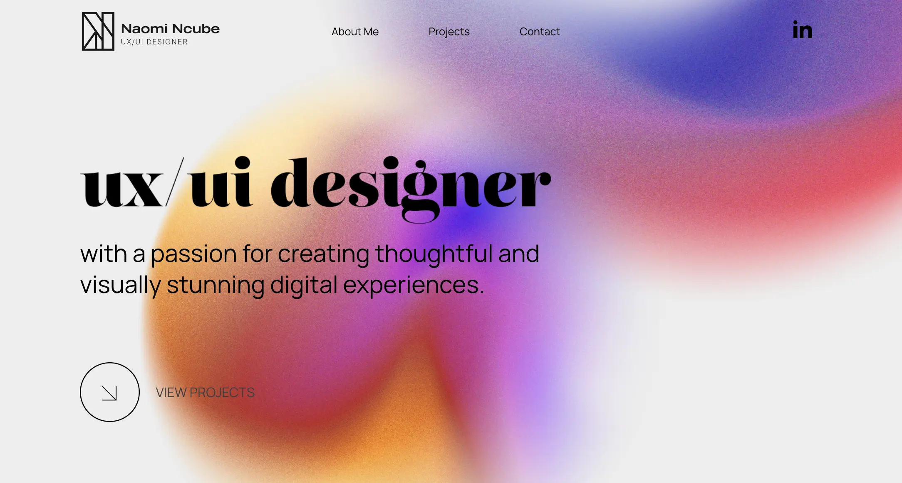

# Hi there! 👋 I'm Zeynep Özdemir

  

# Hi there! 👋 I'm Zeynep Özdemir

  

---

### About Me 🚀

I am a **UI Designer and Frontend Developer** currently studying at **SAIT**. I specialize in creating intuitive mobile and web experiences, focusing on clean aesthetics and user-centric design.

* 📱 Developing mobile apps with **React Native** and **Expo**.
* 🎨 Crafting prototypes and high-fidelity designs in **Figma**.
* 🚀 Building projects like **GoApricot** and **Planora**.
---

### About Me 🚀

I am a **UI Designer and Frontend Developer** currently studying at **SAIT**. I specialize in creating intuitive mobile and web experiences, focusing on clean aesthetics and user-centric design.

* 📱 Developing mobile apps with **React Native** and **Expo**.
* 🎨 Crafting prototypes and high-fidelity designs in **Figma**.
* 🚀 Building projects like **GoApricot** and **APAS**.
